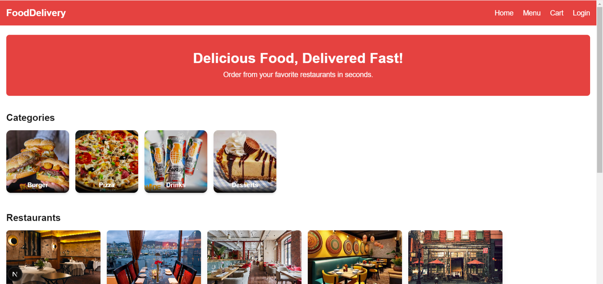

# FoodDelivery

تطبيق ويب لتوصيل الطعام مبني باستخدام Next.js وTailwind CSS.


## 🛠️ التقنيات المستخدمة  
- Next.js (App Router + TypeScript)  
- Tailwind CSS  
- React  
- (اختياري) MongoDB أو أي قاعدة بيانات لو مواصل لاحقاً  
- (اختياري) Express.js للباك‑إند إذا اضفت لاحقاً  

## 🚀 بدء العمل محلياً  
1. انسخ المستودع أو استنخه:  
   ```bash  
   git clone https://github.com/yahya659/FoodDelivery.git  
   cd FoodDelivery  
